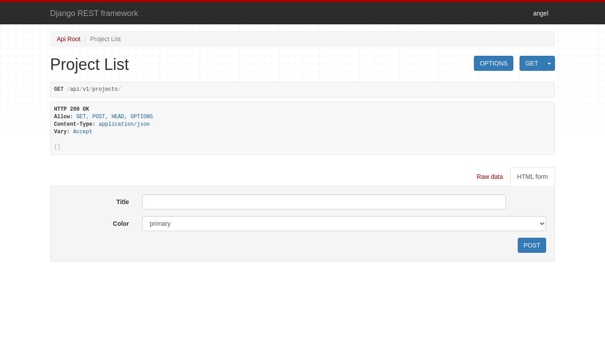

[Firebase](https://firebase.google.com/docs) nos ofrece una gran variedad de servicios y funcionalidades para implementar en nuestras aplicaciones, las cuales abarcan desde el desarrollo hasta la implementación y el crecimiento de nuestras aplicaciones.

Uno de los servicios más populares es [Firestore](https://firebase.google.com/docs/firestore), el cual nos ofrece una base de datos NoSQL rápida, confiable y asequible. Sin embargo, existen ocasiones en las que necesitaremos de utilizar una base de datos relacional, y esto puede ser por las características de la aplicación, o para integrar un *backend* o una *API* *legacy*. Para este propósito Firebase nos permite generar un *token* [JWT](https://jwt.io/), con el cual podemos autenticar a nuestros usuarios en una *API REST*.

A continuación explicaré como utilizar *Firebase Auth* para autenticar en una *API* creada con *Django REST Framework*, y así utilizar esta *API* en una Aplicación Web Progresiva.

- [Demostración PWA](https://djangofire.netlify.app)
- [Código fuente PWA](https://github.com/angelxehg/djangofire-pwa)
- [Código fuente API](https://github.com/angelxehg/djangofire-api)

## Crear PWA y configurar Firebase

El primer paso es crear una Aplicación Web Progresiva con *React*:

- `npx create-react-app [NOMBRE_PROYECTO] --template cra-template-pwa-typescript`

Para dar un mejor diseño a la aplicación podemos utilizar una gran variedad de librerías de UI. En mi caso yo utilicé las librerías *Bootstrap* y *React Bootstrap*:

- `npm i bootstrap react-bootstrap@next`

Para importar los estilos de *Bootstrap* debemos modificar el archivo `index.tsx`, y añadir la siguiente linea:

- `import '../node_modules/bootstrap/dist/css/bootstrap.min.css';`

Posteriormente debemos registrar un nuevo proyecto en la [Consola de Firebase](https://console.firebase.google.com/):

- Crear una [Aplicación Web](https://firebase.google.com/docs/web/setup#register-app)

- Configurar Google como [método de acceso](https://firebase.google.com/docs/auth/web/google-signin#before_you_begin)

- Configurar [dominios autorizados](https://support.google.com/firebase/answer/6400741)

Tras obtener la configuración de la Aplicación Web, almacenar estas variables en el archivo `.env.local`, para evitar publicar estos valores en el repositorio de Git. Consultar más sobre la carga de [variables de entorno en React](https://create-react-app.dev/docs/adding-custom-environment-variables/). Estas son las variables:

```env
REACT_APP_FIREBASE_API_KEY=
REACT_APP_FIREBASE_AUTH_DOMAIN=
REACT_APP_FIREBASE_PROJECT_ID=
REACT_APP_FIREBASE_STORAGE_BUCKET=
REACT_APP_FIREBASE_MESSAGE_SENDER_ID=
REACT_APP_FIREBASE_APP_ID=
```

Para cargar estas variables creamos el archivo `firebaseConfig.ts` con el siguiente contenido:

```typescript
const firebaseConfig = {
  apiKey: process.env.REACT_APP_FIREBASE_API_KEY,
  authDomain: process.env.REACT_APP_FIREBASE_AUTH_DOMAIN,
  projectId: process.env.REACT_APP_FIREBASE_PROJECT_ID,
  storageBucket: process.env.REACT_APP_FIREBASE_STORAGE_BUCKET,
  messagingSenderId: process.env.REACT_APP_FIREBASE_MESSAGE_SENDER_ID,
  appId: process.env.REACT_APP_FIREBASE_APP_ID
};

export default firebaseConfig;
```

Para configurar Firebase utilicé la librería [Reactfire](https://github.com/FirebaseExtended/reactfire), la cual instalé con el comando `npm install --save reactfire firebase`. Es necesario pasar la configuración al componente `FirebaseAppProvider`, en el archivo `index.tsx`:

```jsx
ReactDOM.render(
  <FirebaseAppProvider firebaseConfig={firebaseConfig}>
    <React.StrictMode>
      <App />
    </React.StrictMode>
  </FirebaseAppProvider>,
  document.getElementById('root')
);
```

Para habilitar el Inicio de sesión con Google es necesario utilizar la función `signInWithPopup`, y pasar `GoogleAuthProvider` como argumento:

```tsx
import firebase from "firebase/app";

const googleProvider = new firebase.auth.GoogleAuthProvider();

export const loginWithGoogle = async () => {
  return await firebase.auth().signInWithPopup(googleProvider);
}

const LoginPage = () => (
  <main className="mt-3">
    <Button onClick={loginWithGoogle}>
      Iniciar sesión con Google
    </Button>
  </main>
)
```

Al final resultará una PWA como [esta](https://djangofire.netlify.app/):


## Crear una API REST con Django REST Framework

Para crear el API REST con Django es necesario ejecutar los comandos `python3 -m django startproject djangofire` y `./manage.py startapp projectmin`. Para crear modelos y tablas hay que realizar estos cambios:

- `projectmin/models.py`

```python
from django.db import models
from django.conf import settings


class Project(models.Model):

    COLORS = (
        ("primary", "primary"),
        ("secondary", "secondary"),
        ("success", "success"),
        ("danger", "danger"),
        ("warning", "warning"),
        ("info", "info"),
    )

    title = models.CharField(max_length=100)
    color = models.CharField(max_length=10, choices=COLORS, default="primary")
    owner = models.ForeignKey(
        settings.AUTH_USER_MODEL,
        on_delete=models.CASCADE,
        related_name='projects'
    )
```

- `projectmin/admin.py`

```python
from django.contrib import admin
from projectmin.models import Project


@admin.register(Project)
class ProjectAdmin(admin.ModelAdmin):
    list_display = ('id', 'title', 'color', 'owner')
```

Para implementar las funcionalidades de una API REST instalé Django REST Framework con el comando `pip install djangorestframework`, y realicé los siguientes cambios:

- `projectmin/serializers.py`

```python
from django.shortcuts import render
from rest_framework import serializers
from projectmin.models import Project


class ProjectSerializer(serializers.ModelSerializer):

    owner = serializers.HiddenField(
        default=serializers.CurrentUserDefault()
    )

    class Meta:
        model = Project
        fields = ('id', 'title', 'color', 'owner')
```

- `projectmin/views.py`

```python
from django.shortcuts import render
from rest_framework import viewsets
from projectmin.models import Project
from projectmin.serializers import ProjectSerializer


class ProjectViewSet(viewsets.ModelViewSet):
    queryset = Project.objects.all()
    serializer_class = ProjectSerializer

    def get_queryset(self):
        user = self.request.user
        return Project.objects.filter(owner=user)
```

- `projectmin/urls.py`

```python
from rest_framework import routers
from projectmin.views import ProjectViewSet

projectmin_router = routers.DefaultRouter()
projectmin_router.register(r'projects', ProjectViewSet)
```

- `djangofire/urls.py`

```python
from django.contrib import admin
from django.urls import path
from django.urls.conf import include
from projectmin.urls import projectmin_router

urlpatterns = [
    path('admin/', admin.site.urls),
    path('api/v1/', include(projectmin_router.urls)),
]
```

Para asegurar que usuarios no autorizados hagan cambios hay que realizar los siguientes cambios:

- `djangofire/settings.py`

```python
REST_FRAMEWORK = {
    'DEFAULT_PERMISSION_CLASSES': (
        'rest_framework.permissions.IsAuthenticated',
    ),
    'DEFAULT_AUTHENTICATION_CLASSES': (
        'rest_framework.authentication.BasicAuthentication',
        'rest_framework.authentication.SessionAuthentication',
    ),
}
```

Finalmente generamos las tablas con el comando `./manage.py makemigrations`

## Desplegar API REST en Heroku

Para que Django funcione en Heroku hay que realizar los siguientes cambios:

- `Procfile`

```Procfile
release: python manage.py migrate
web: gunicorn djangofire.wsgi
```

- `djangofire/production.py`

```python
from .settings import *

import os
import django_heroku

# Usar SECRET_KEY desde Heroku enviroment values
SECRET_KEY = os.environ['SECRET_KEY']
# Desactivar modo debug
DEBUG = os.getenv('DJANGO_DEBUG', 'FALSE') == 'TRUE'
# Permitir Host de Heroku enviroment values
ALLOWED_HOSTS = [os.environ['HOST']]

# Activar paquete Django-Heroku.
django_heroku.settings(locals())
```

- `requirements.txt`

```txt
Django==3.2.0
django-heroku==0.3.1
django-cors-headers==3.6.0
djangorestframework==3.12.4
gunicorn==20.1.0
```

Para desplegar este proyecto en Heroku es necesario inicializar un repositorio con [Git](https://git-scm.com/) y haber hecho *Commit* a todos los cambios anteriores. Despues podremos ejecutar los siguientes comandos:

```bash
heroku create [NOMBRE PROYECTO]
heroku config:set SECRET_KEY="[SECRET_KEY]"
heroku config:set HOST="[Heroku URL]" # La url que resultó en heroku create
git push heroku main # O master, dependiendo del nombre que utilices para tu rama principal
heroku run python manage.py createsuperuser # Crear usuario administrador
```

Al final podremos visitar la url de nuestro proyecto en Heroku, pero obtendremos un error ya que la ruta `/` no fue implementada, pero podemos navegar a la ruta `/admin` e iniciar sesión en Django Admin. Ya iniciada la sesión podremos ir a la ruta `/api/v1/projects`:



Esta interfaz viene incluida con Django REST Framework y para desactivarla debemos incluir el encabezado `'Content-Type': "application/json",` en las solicitudes HTTP

## Validar JWT de Firebase

Para validar los tokens JWT de Firebase podemos usar la libreria `drf_firebase_auth`, con la siguiente configuración

- `djangofire/production.py`

```python
INSTALLED_APPS = INSTALLED_APPS + [
    'drf_firebase_auth'
]
REST_FRAMEWORK = {
    'DEFAULT_PERMISSION_CLASSES': (
        'rest_framework.permissions.IsAuthenticated',
    ),
    'DEFAULT_AUTHENTICATION_CLASSES': (
        'rest_framework.authentication.BasicAuthentication',
        'rest_framework.authentication.SessionAuthentication',
        'drf_firebase_auth.authentication.FirebaseAuthentication',
    ),
}
# Configurar Firebase JWT
DRF_FIREBASE_AUTH = {
    # allow anonymous requests without Authorization header set
    'ALLOW_ANONYMOUS_REQUESTS': os.getenv('ALLOW_ANONYMOUS_REQUESTS', False),
    # allow creation of new local user in db
    'FIREBASE_CREATE_LOCAL_USER': os.getenv('FIREBASE_CREATE_LOCAL_USER', True),
    # attempt to split firebase user.display_name and set local user
    # first_name and last_name
    'FIREBASE_ATTEMPT_CREATE_WITH_DISPLAY_NAME': os.getenv('FIREBASE_ATTEMPT_CREATE_WITH_DISPLAY_NAME', True),
    # commonly JWT or Bearer (e.g. JWT <token>)
    'FIREBASE_AUTH_HEADER_PREFIX': os.getenv('FIREBASE_AUTH_HEADER_PREFIX', 'Bearer'),
    # verify that JWT has not been revoked
    'FIREBASE_CHECK_JWT_REVOKED': os.getenv('FIREBASE_CHECK_JWT_REVOKED', True),
    # require that firebase user.email_verified is True
    'FIREBASE_AUTH_EMAIL_VERIFICATION': os.getenv('FIREBASE_AUTH_EMAIL_VERIFICATION', False),
    # secrets of firebase
    'FIREBASE_SERVICE_ACCOUNT_KEY': {
        "type": "service_account",
        "project_id": os.getenv('FIREBASE_PROJECT_ID', ''),
        "private_key_id": os.getenv('FIREBASE_PRIVATE_KEY_ID', ''),
        "private_key": os.getenv('FIREBASE_PRIVATE_KEY', '').replace('\\n', '\n'),
        "client_email": os.getenv('FIREBASE_CLIENT_EMAIL', ''),
        "client_id": os.getenv('FIREBASE_CLIENT_ID', ''),
        "auth_uri": "https://accounts.google.com/o/oauth2/auth",
        "token_uri": "https://oauth2.googleapis.com/token",
        "auth_provider_x509_cert_url": "https://www.googleapis.com/oauth2/v1/certs",
        "client_x509_cert_url": os.getenv('FIREBASE_CLIENT_X509_URL', ''),
    }
}
```

Tambien es necesario incluir esta librería en el archivo de requerimientos:

```txt
Django==3.2.0
django-heroku==0.3.1
drf-firebase-auth==1.0.0
django-cors-headers==3.6.0
djangorestframework==3.12.4
gunicorn==20.1.0
```

Es necesario obtener el archivo .json de cuenta de servicio en Configuración > Cuentas de servicio de la consola de Firebase. Se debe resguardar este archivo, ya que no se puede recuperar. **No** se debe incluir en el repositorio de Git. Estos valores se obtendrán por medio de variables de entorno.

Para desplegar estos cambios en Heroku es necesario hacer *Commit* a todos los cambios anteriores. Despues podremos ejecutar los siguientes comandos:

```bash
heroku config:set FIREBASE_PROJECT_ID="[VALOR]"
heroku config:set FIREBASE_PRIVATE_KEY_ID="[VALOR]"
heroku config:set FIREBASE_PRIVATE_KEY="[VALOR]"
heroku config:set FIREBASE_CLIENT_EMAIL="[VALOR]"
heroku config:set FIREBASE_CLIENT_ID="[VALOR]"
heroku config:set FIREBASE_CLIENT_X509_URL="[VALOR]"
git push heroku main # O master, dependiendo del nombre que utilices para tu rama principal
```

Finalmente para obtener el token JWT de Firebase, este se puede obtener con la función `getIdToken()`, la cual viene en cualquier instancia de `firebase.auth.User`. Este token debe ser incluido en los encabezados de cada solicitud HTTP. Utilicé una funcion para poder generar este header:

```tsx
import firebase from "firebase/app";

export const getHeaders = async (): Promise<Headers> => {
  const currentUser = firebase.auth().currentUser;
  if (!currentUser) {
    throw new Error('No ha iniciado sesión');
  }
  const token = await currentUser.getIdToken();
  const autorization = `Bearer ${token}`
  const headers = new Headers({
    'Authorization': autorization,
    'Content-Type': "application/json",
  });
  return headers;
}
```

Para listar todos los proyectos, podemos utilizar `fetch()`, como se muestra a continuación:

```tsx
export interface Project {
  id: number;
  title: string;
  color: string;
}

export const getProjects = async (): Promise<Project[]> => {
  const headers = await getHeaders();
  const url = `${apiURL}projects`;
  const res = await fetch(url, {
    method: 'GET',
    headers: headers,
    redirect: 'follow'
  });
  if (res.status !== 200) {
    console.error(res);
    throw new Error('Error al cargar Proyectos');
  }
  const body: Project[] = await res.json();
  localStorage.setItem('ALL_PROJECTS', JSON.stringify(body));
  return body;
}
```

Implementé las operaciones GET, POST, PATCH y DELETE en el [demo](https://djangofire.netlify.app/), y puedes consultar el código fuente de la aplicación en [GitHub](https://github.com/angelxehg/djangofire-pwa).

## Conclusión

La flexibilidad que nos ofrece una herramienta como Firebase hace posible implementar múltiples funcionalidades a nuestra aplicación, utilizar varios patrones de diseño, y adaptarnos lo mejor posible a los requerimientos del software.

En este Post se explora una de estas posibilidades, la de usar Firebase para autenticar en una API REST, la cual incluso podría acceder a Firestore, administrar usuarios, entre otras funcionalidades ofrecidas por [Firebase Admin](https://firebase.google.com/docs/admin/setup).

Esta solución no esta restringida a un solo framework o lenguaje de programación, ya que esta librería esta disponible para Node.js, Java, Python, Go y C#. Así, las posibilidades se vuelven infinitas.

## Recursos y referencias

- [Documentación Firebase](https://firebase.google.com/docs)
- [Documentación React](https://es.reactjs.org/)
- [Documentación Django](https://www.djangoproject.com/)
- [Documentación Django REST Framework](https://www.django-rest-framework.org/)
- [Documentación  drf-firebase-auth](https://pypi.org/project/drf-firebase-auth/)
